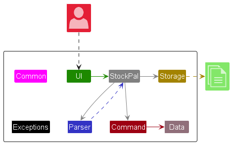
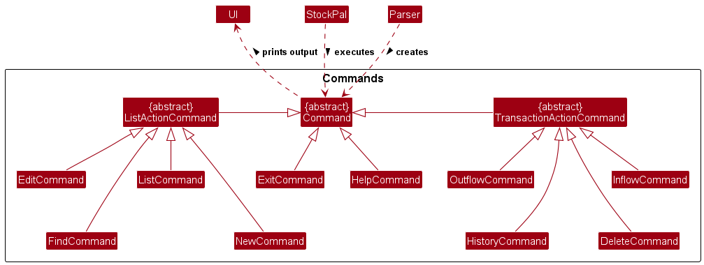
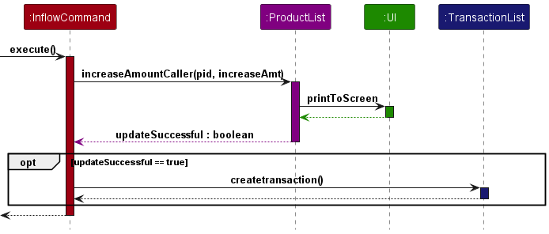
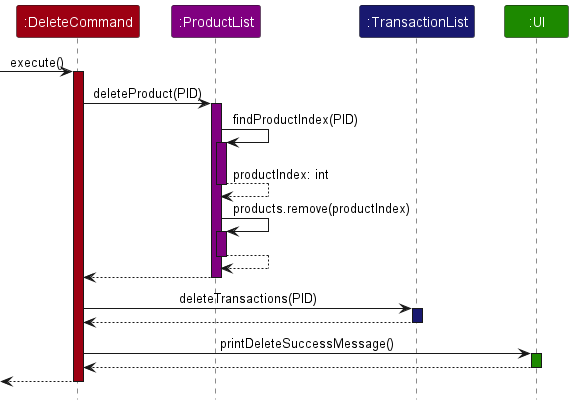

<!-- TOC -->
  * [**Acknowledgements**](#acknowledgements)
  * [**Design**](#design)
    * [Architecture](#architecture)
    * [UI component](#ui-component)
    * [Parser component](#parser-component)
    * [Command component](#command-component)
    * [Data component](#data-component)
    * [Storage component](#storage-component)
    * [Common Classes](#common-classes)
    * [Exception Classes](#exception-classes)
  * [**Implementation**](#implementation)
    * [Command Feature](#command-feature)
    * [Add Product Feature](#add-product-feature)
    * [Edit Product Feature](#edit-product-feature)
      * [Implementation](#implementation-1)
    * [List Feature](#list-feature)
    * [InflowCommand Feature](#inflowcommand-feature)
    * [Implementation](#implementation-2)
    * [OutflowCommand Feature](#outflowcommand-feature)
    * [Implementation](#implementation-3)
    * [Delete product feature](#delete-product-feature)
      * [Implementation](#implementation-4)
    * [Find product feature](#find-product-feature)
    * [History product feature](#history-product-feature)
  * [**Appendix: Requirements**](#appendix-requirements)
    * [Product scope](#product-scope)
  * [User Stories](#user-stories)
  * [Non-Functional Requirements](#non-functional-requirements)
  * [Glossary](#glossary)
  * [**Appendix: Instructions for manual testing**](#appendix-instructions-for-manual-testing)
    * [Adding a Product](#adding-a-product)
    * [Editing Product Details](#editing-product-details)
    * [Increase Product Quantity](#increase-product-quantity)
    * [Decrease Product Quantity](#decrease-product-quantity)
    * [Deleting a product](#deleting-a-product)
    * [Finding a keyword in the Product list](#finding-a-keyword-in-the-product-list-)
    * [Finding all past transactions for a particular product in the Product list](#finding-all-past-transactions-for-a-particular-product-in-the-product-list)
<!-- TOC -->

## **Acknowledgements**

* The formatting for the developer guide is inspired by [AB-3](https://se-education.org/addressbook-level3/DeveloperGuide.html).

Third-party libraries:
* [OpenCSV](https://opencsv.sourceforge.net/) - This package is licensed under [Apache2](https://opencsv.sourceforge.net/licenses.html), which is a business-friendly open-source software license.
* [JSON-Java](https://github.com/stleary/JSON-java) - This package is licensed under [Public Domain](https://creativecommons.org/public-domain/), which is free to be used by anyone.


--------------------------------------------------------------------------------------------------------------------

## **Design**

<div style="padding: 15px; border: 1px solid transparent; margin-bottom: 20px; border-radius: 4px; color: #8a6d3b; background-color: #fcf8e3;">
:bulb: <strong>Tip:</strong> The <code>.puml</code> files used to create diagrams in this document are in the <code>docs/diagrams</code> folder. Refer to the <a href="https://se-education.org/guides/tutorials/plantUml.html" target="_blank"><i>PlantUML Tutorial</i> at se-edu/guides</a> to learn how to create and edit diagrams.
</div>

### Architecture


The ***Architecture Diagram*** given above explains the high-level design of the App.

Given below is a quick overview of main components and how they interact with each other.

**Main components of the architecture**

[**`StockPal`**](https://github.com/AY2324S2-CS2113T-T09-3/tp/blob/master/src/main/java/seedu/stockpal/StockPal.java) is in charge of the app launch and shut down.

The bulk of the app's work is done by the following five components:

* [**`UI`**](#ui-component): The UI of the App.
* [**`Parser`**](#parser-component): Parses user input into respective commands.
* [**`Command`**](#command-component): The command executor.
* [**`Data`**](#data-component): Holds the data of the App in memory.
* [**`Storage`**](#storage-component): Reads data from, and writes data to, the hard disk.

[**`Commons`**](#common-classes) represents a collection of classes used by multiple components above.
[**`Exceptions`**](#exceptions-classes) represents a collection of exceptions used by multiple components above.

**How the architecture components interact with each other**

The *Sequence Diagram* below shows how the components interact with each other for the scenario where the user issues the command `delete 1`.


The sections below give more details of each component.

### UI component
The **API** of this component is specified in [`Ui.java`](https://github.com/AY2324S2-CS2113T-T09-3/tp/tree/master/src/main/java/seedu/stockpal/ui/Ui.java)


The UI component,
* gets user input from the user, and returns it to `StockPal` component for parsing and execution of respective commands.
* waits on the `Command` component as the commands will be calling the UI to print messages.
* depends on the `Command` component, as it is required by the respective commands to output specified messages.

### Parser component

**API** : [`Parser.java`](https://github.com/AY2324S2-CS2113T-T09-3/tp/blob/master/src/main/java/seedu/stockpal/parser/Parser.java)


How the parsing works:
1. When user inputs, the input is passed to the `Parser`.
2. `Parser` first extracts the command.
3. Using the extracted command, `Parser` will perform different validation checks on the arguments supplied in the
input, iteratively. 

    For example `edit 1 n/newName q/100` will be checked in the order: Command name: `edit`, PID: `1`, Name: `newName`, Quantity: `100`, Price: `null`, and lastly Description: `null`. 
4. Arguments (mainly the `pid`, `name`, `quantity`, `price`, `description`, `amount` fields) are validated. 
Exceptions are thrown when the fields do not pass their respective type checks.
5. Once validation passes, `Parser` uses the validated arguments to creates an instance of that particular command. 
For example, a `delete` command will cause `Parser` to create a new instance of `DeleteCommand(pid)`.
6. The created command object is returned back to `main` function for further processing.

### Command component

**API** : [`Command.java`](https://github.com/AY2324S2-CS2113T-T09-3/tp/blob/master/src/main/java/seedu/stockpal/commands/Command.java)



How the `Command` component works:
1. `Parser` first creates the respective `Command` after parsing user input. Then, the `Command` is passed to `StockPal`, awaiting execution.
2. `StockPal` then executes the respective `Command`.
3. After execution, be it successful or unsuccessful, `Command` calls on the `UI` component to output the results to screen.

### Data component

**API** : [`Data`](https://github.com/AY2324S2-CS2113T-T09-3/tp/blob/master/src/main/java/seedu/stockpal/data)

The following is a class diagram of the `Data` component.


The `Data` component,
* stores StockPal's data i.e., all `Product` objects (which are contained in a `ProductList` object) and all `Transaction` objects (which are contained in a `TransactionList` object).
* does not depend on any of the other components (as the `Data` represents data entities of the domain, they should make sense on their own without depending on other components).

### Storage component

**API** : [`Storage`](https://github.com/AY2324S2-CS2113T-T09-3/tp/blob/master/src/main/java/seedu/stockpal/storage/)


The `Storage` component,
* can save product list data in CSV format, and load them back into corresponding Products.
* depends on the `StockPal` component (because the `Storage` component's job is to save/load objects that belong to `StockPal`)
* consists of the classes `Storage`, `CsvWriter` and `CsvReader`.
  * `Storage` defines methods that loads and saves product data.
  * `CsvWriter` is responsible for handling the writing of product data to the CSV data file.
  * `CsvReader` is responsible for handling the reading of product data from the CSV data file.

In addition to saving products, the `Storage` component has a subcomponent `TransactionStorage`, which
* can save transaction list data in JSON format, and load them back into corresponding Transactions.
* also depends on the `StockPal` component
* consists of the `TransactionStorage`, `JsonWriter` and `JsonReader`.
    * `TransactionStorage` defines methods that loads and saves transaction data.
    * `JsonWriter` is responsible for handling the writing of transaction data to the JSON data file.
    * `JsonReader` is responsible for handling the reading of transaction data from the JSON data file.

### Common Classes

Classes used by multiple components are in the `seedu.stockpal.common` package.
The `common` package consists of 2 useful utility classes that are mainly used for printing of output to screen, as well as output messages.

### Exception Classes

Exceptions classes used by multiple components are in the `seedu.stockpal.exceptions` package.

--------------------------------------------------------------------------------------------------------------------

## **Implementation**
This section describes some noteworthy details on how certain features are implemented.

### Command Feature
The following sequence diagram summarizes what happens when a user inputs a valid command.


Validation of the user input is done in `Parser`, hence `XYZCommand` assumes that all fields provided upon creation
of a `XYZCommand` object are properly formatted.

### Help Feature

The `help` command is used to display the help page for either all or individual commands.

The `help` feature is facilitated by `HelpCommand` which extends `Command`.

Details for individual commands are stored within the individual classes as static variables.
The details are stored as 5 variables as follows.

| Variable                  | What it represents                                    | Example                                                  |
|---------------------------|-------------------------------------------------------|----------------------------------------------------------|
| COMMAND_KEYWORD           | The keyword used to identify the command.             | "help"                                                   |
| COMMAND_DESCRIPTION       | Description of the command.                           | "Provides command details for all or specific commands." |
| COMMAND_USAGE             | The format of the command.                            | "help [COMMAND_KEYWORD]"                                 |
| COMMAND_FLAGS             | Placeholder value used to denote command arguments.   | {"COMMAND_KEYWORD"}                                      |
| COMMAND_FLAG_DESCRIPTIONS | Description of what the placeholder value represents. | {"Command to display details for"}                       |

`FormatUtils#formatCommandDetails()` takes in these 5 variables as arguments and produces a formatted version of the details.

Example of formatted version of details based on the 5 example variables above:
```
====================================================================================
Command: help

Description: Provides command details for all or specific commands.

Usage: help [COMMAND_KEYWORD]

Options:
COMMAND_KEYWORD       Command to display details for
====================================================================================
```


### Add Product Feature

The NewCommand class is responsible for adding a new product to the inventory in the StockPal application.

The add product feature is facilitated by `NewCommand` which extends `Command`.

Specific validations are still carried out within `NewCommand`.
1. Checking if the new product name is the same as an existing product name.

Once all validation is completed, adding of product is done by calling `ProductList#addProduct()`.

The following sequence diagram details how `AddCommand#execute()` functions.


### Edit Product Feature
#### Implementation
The `edit` command is used to edit product details such as name, quantity, price and description.

The edit product feature is facilitated by `EditCommand` which extends `Command`.

Specific validations are still carried out when updating the product details.
1. Checking if at least 1 field (name, quantity, price or description) is provided.
2. Checking if the product ID (PID) belongs to an existing product.
3. Checking if the edited product name is the same as an existing product name.

Updating of product details is done by calling `ProductList#updateProduct()`.

The following sequence diagram details how `EditCommand#execute()` functions.


### List Feature
The ListCommand class is responsible for sorting and printing out the products in the list. 

**Attributes**
* sortType: Additional optional flags the user can set to sort the products in the list.

**Methods**
* `ListCommand`: Constructor for creating a new instance of the ListCommand class.
* `execute`: Method to list out the products in the product list.
* `sortListAccordingly`: Method to sort the list according to the products' PID, products' name or products' quantity.

The following sequence diagram illustrates how `ListCommand#execute()` functions


### InflowCommand Feature

The `InflowCommand` class is used to increase the quantity of a specific product in the inventory.
This could represent scenarios like receiving new stock and updating inventory with new quantities.

### Implementation
The inflow product feature is facilitated by `InflowCommand` which extends `Command`.

Specific validations are still carried out within the `InflowCommand`.
1. Checking if the product ID (PID) belongs to an existing product.
2. Checking if the addition of inflow quantity and existing quantity will result in an integer overflow.

Once all validations are completed, increasing a product quantity is done by calling `ProductList#increaseAmountCaller()`.

The following sequence diagram shows how the InflowCommand works. <br><br>



### OutflowCommand Feature

The `OutflowCommand` class is used to decrease the quantity of a specific product in the inventory.
This could represent scenarios like selling products and updating inventory with new updated quantities.

### Implementation
The outflow product feature is facilitated by `OutflowCommand` which extends `Command`.

Specific validations are still carried out within the `OutflowCommand`.
1. Checking if the product ID (PID) belongs to an existing product.
2. Checking if the outflow quantity is larger than the existing quantity.

Once all validations are completed, decreasing a product quantity is done by calling `ProductList#decreaseAmountCaller()`.

The following sequence diagram shows how the InflowCommand works. <br><br>


### Delete product feature

#### Implementation
The delete function is mainly facilitated by `DeleteCommand`. It extends from `Command`.

**Attributes**
`pid` The unique Product ID for the product to be deleted from the StockPal inventory `productList`

**Methods**
* `DeleteCommand`: Constructor for creating a new instance of the DeleteCommand class.
* `execute`: Method to delete `product` with PID `pid` from StockPal's `productList`.
* `ProductList#deleteProduct`: Method called by `execute` to delete product in `productList`.

Given below is an example usage scenario and how the delete function behaves at each step. The scenario assumes that the
user has a `product` with `pid` of 2 in `StockPal`'s `productList`.

Step 1. The user executes `delete 2` command to delete a specific `product` with `pid` of 2.
Step 2. The product is successfully deleted from the inventory list.

**Possible Exceptions that can be thrown**
* PidNotFoundException: Thrown when user-supplied PID does not correspond to any of the products in the inventory
currently.

The following sequence diagram shows how `DeleteCommand#execute()` functions. The sequence diagram assumes that PID
provided is valid. 



### Find product feature

The FindCommand class is responsible for finding a new product to the inventory in the StockPal application.


The following sequence diagram details how `FindCommand#execute()` functions.


### History product feature

The HistoryCommand class is responsible for finding any inflows or outflows for a particular
PID in the StockPal application.

The following sequence diagram details how `HistoryCommand#execute()` functions.

 --------------------------------------------------------------------------------------------------------------------

## **Appendix: Requirements**

### Product scope

**Target user profile**:
* Small business owners who are looking to keep track of their inventory using CLI
* Possibly established companies looking to expand our application

**Value proposition**: <br>
Traditional inventory management methods often involve manual data entry, spreadsheets, and paper-based
tracking systems. These processes are time-consuming, error-prone, and lack real-time visibility into
inventory status. StockPal allows users to quickly update, track, and monitor inventory data through
intuitive command-line commands, saving time and improving efficiency.

## User Stories

| Version | As a ...                              | I want to ...                                     | So that I can ...                                                                            |
|---------|---------------------------------------|---------------------------------------------------|----------------------------------------------------------------------------------------------|
| v1.0    | beginner user                         | have a small manual page                          | aware of the commands that I can enter                                                       |
| v1.0    | forgetful user of StockPal            | see usage instructions                            | refer to them when I forget how to use the application                                       |
| v1.0    | small business owner                  | add details of products easily                    | track my products' stock                                                                     |
| v1.0    | user that makes mistakes              | be able to edit details of the products easily    | easily change the name / price / quantity /description of the products, if there is an error |
| v1.0    | continuous user of StockPal           | have my entered data to be saved                  | track all the products that I have entered from past uses of the app                         |
| v2.0    | business owner                        | view at past inflow/outflows of a product         | keep track of sales data of the product and know which products are of higher demand         |
| v2.0    | user that owns a lot of products      | find products' name that contain the keyword      | find my product, or want to get the product's PID in a long list of products                 |
| v2.0    | business owner doing a sales analysis | find my products' past transactions               | keep track of the changes in my products' quantity                                           |
| v2.0    | business owner that is forgetful      | have a warning when my products have low quantity | restock them before they go out of stock.                                                    |

## Non-Functional Requirements

* Any mainstream OS with Java `11` installed

## Glossary

* *PID (Product ID)* - A unique number assigned to each product for identification purposes.
* Mainstream OS: Windows, Linux, Unix, MacOS

--------------------------------------------------------------------------------------------------------------------

## **Appendix: Instructions for manual testing**

### Adding a Product
1. No prerequisites needed. <br><br>

2. Test case 1: `new n/Drinking Cup q/20`
   Expected: The product will be added. Name of the product is `Drinking Cup`, 
   Quantity of chocolate Milk stock is `20` units. <br><br>

   Test case 2: `new n/Chocolate Milk q/100 p/2.00 d/Marigold HL Milk`
   Expected: The product will be added. Name of the product is `Chocolate Milk`,
   Quantity of chocolate Milk stock is `100 ` units
   Price of each unit is $`2.00`
   Description of the Chocolate Milk product is `Marigold HL Milk`, which is the brand.

### Editing Product Details
1. Prerequisites: List all products using `list` command. There should be at least multiple products in the list. <br><br>

2. Test case 1: `edit 1 n/Updated name d/Updated description` 
   Expected: The name and description of the product with Product ID (PID) 1 
   will be changed to `Updated name` and `Updated description` respectively. <br><br>

   Test case 2: `edit 1 q/100 p/0.99`
   Expected: The quantity and price of the product with Product ID (PID) 1
   will be changed to `100` and `0.99` respectively.

### Increase Product Quantity
1. Prerequisites: List all products using `list` command. There should be a particular product with `pid` 1 and `pid` 2.  
   The product with `pid` 1 should have quantity 30 and `pid` 2 should have quantity 100. <br><br>

2. Test case 1 : `inflow 1 a/20`
   Expected: The quantity of the product with Product ID (PID) 1 will increase by 20.
    - Do note that the Amount to increase must be less than INT_MAX.  <br><br>

   Test case 2: `inflow 1 a/2147483650`
   Expected: `Integer input exceeds largest integer allowed. Max integer is 2147483647` will be printed out.

### Decrease Product Quantity
1. Prerequisites: List all products using `list` command. There should be a particular product with `pid` 1 and `pid` 2.
   The product with `pid` 1 should have quantity 30 and `pid` 2 should have quantity 100.  <br><br>

2. Test case 1 : `outflow 1 a/20`
   Expected: `Warning! This product is low in quantity.
              Quantity updated. Quantity: 10`  <br><br>

   Test case 2: `outflow 2 a/20`
   Expected: `Quantity updated. Quantity: 80` will be printed out.

### Deleting a product
1. Prerequisites: List all products using `list` command. There should be a particular product with `pid` of 1 and no 
product with `pid` of 2. <br><br>

2. Test case 1: `delete 1`. 
   Expected: `product` with `pid` of 1 is deleted from the list. `"Product has been deleted"` is printed to the user. <br><br>

   Test case 2: `delete 2`.
   Expected: `"Product with pid: 2 not found"`


### Finding a keyword in the Product list 
1. No prerequisites needed. <br><br>

2. Test case: `find Cor`<br>
   Expected: A list of products will be printed out if there is a match, 
   otherwise `No match found.` will be printed out. 


### Finding all past transactions for a particular product in the Product list
1. Prerequisites: List all products using `list` command. There should be at least multiple products in the list. <br><br>

2. Test case: `history 1`<br>
   Expected:
   A list of transactions will be printed out if there is a match,
   otherwise `No match found.` will be printed out.
