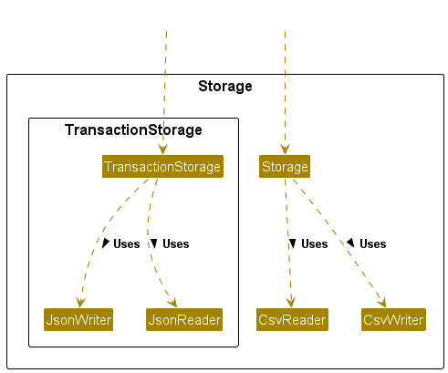

---
layout: page
title: Developer Guide
---
* Table of Contents
  {:toc}

--------------------------------------------------------------------------------------------------------------------

## **Acknowledgements**

* The formatting for the developer guide is inspired by [AB-3](https://se-education.org/addressbook-level3/DeveloperGuide.html).

Third-party libraries:
* [OpenCSV](https://opencsv.sourceforge.net/) - This package is licensed under [Apache2](https://opencsv.sourceforge.net/licenses.html), which is a business-friendly open-source software license.

--------------------------------------------------------------------------------------------------------------------

## **Design**

:bulb: **Tip:** The `.puml` files used to create diagrams in this document `docs/diagrams` folder. Refer to the [_PlantUML Tutorial_ at se-edu/guides](https://se-education.org/guides/tutorials/plantUml.html) to learn how to create and edit diagrams.

### Architecture

The ***Architecture Diagram*** given above explains the high-level design of the App.

Given below is a quick overview of main components and how they interact with each other.

**Main components of the architecture**

[**`StockPal`**](https://github.com/AY2324S2-CS2113T-T09-3/tp/blob/master/src/main/java/seedu/stockpal/StockPal.java) is in charge of the app launch and shut down.

The bulk of the app's work is done by the following five components:

* [**`UI`**](#ui-component): The UI of the App.
* [**`Parser`**](#parser-component): Parses user input into respective commands.
* [**`Commands`**](#commands-component): The command executor.
* [**`Data`**](#data-component): Holds the data of the App in memory.
* [**`Storage`**](#storage-component): Reads data from, and writes data to, the hard disk.

[**`Commons`**](#common-classes) represents a collection of classes used by multiple components above.
[**`Exceptions`**](#exceptions-classes) represents a collection of exceptions used by multiple components above.

**How the architecture components interact with each other**

The *Sequence Diagram* below shows how the components interact with each other for the scenario where the user issues the command `delete 1`.

The sections below give more details of each component.

### UI component
The **API** of this component is specified in [`Ui.java`](https://github.com/AY2324S2-CS2113T-T09-3/tp/tree/master/src/main/java/seedu/stockpal/ui/Ui.java)

### Parser component

**API** : [`Parser.java`](https://github.com/AY2324S2-CS2113T-T09-3/tp/blob/master/src/main/java/seedu/stockpal/parser/Parser.java)

### Commands component

**API** : [`Command.java`](https://github.com/AY2324S2-CS2113T-T09-3/tp/blob/master/src/main/java/seedu/stockpal/commands/Command.java)

### Data component

**API** : [`Data`](https://github.com/AY2324S2-CS2113T-T09-3/tp/blob/master/src/main/java/seedu/stockpal/data)

### Storage component

**API** : [`Storage.java`](https://github.com/AY2324S2-CS2113T-T09-3/tp/blob/master/src/main/java/seedu/stockpal/storage/Storage.java)

The `Storage` component,
* can save product list data in CSV format, and load them back into corresponding Products.
* depends on the `StockPal` component (because the `Storage` component's job is to save/load objects that belong to `StockPal`)
* consists of the classes `Storage`, `CsvWriter` and `CsvReader`.
  * `Storage` defines methods that loads and saves data.
  * `CsvWriter` is responsible for handling the writing of data to the CSV data file.
  * `CsvReader` is responsible for handling the reading of data from the CSV data file.

### Common classes

Classes used by multiple components are in the `seedu.stockpal.common` package.

### Exception classes

Exceptions classes used by multiple components are in the `seedu.stockpal.exceptions` package.

--------------------------------------------------------------------------------------------------------------------

## **Implementation**

This section describes some noteworthy details on how certain features are implemented.

### Add new product feature

The NewCommand class is responsible for adding a new product to the inventory in the StockPal application.

**Attributes**
* name: The name of the product.
* quantity: The initial quantity of the product.
* price: The price of the product.
* description: The description of the product.

**Methods**
* `NewCommand`: Constructor for creating a new instance of the NewCommand class.
* `execute`: Method to add the new product to the product list.
* `createProduct`: Method to create a new product with a unique product ID.

The following sequence diagram shows how an add operation works:

### Edit product feature

#### Implementation

#### Design consideration

### List feature

The ListCommand class is responsible for sorting and printing out the products in the list. 

**Attributes**
* sortType: Additional optional flags the user can set to sort the products in the list.

**Methods**
* `ListCommand`: Constructor for creating a new instance of the ListCommand class.
* `execute`: Method to list out the products in the product list.
* `sortListAccordingly`: Method to sort the list according to the products' PID, products' name or products' quantity.

The following sequence diagram shows how a list operation works, by calling `list`.

--------------------------------------------------------------------------------------------------------------------

## **Appendix: Requirements**

### Product scope

**Target user profile**:

**Value proposition**:

{Describe the value proposition: what problem does it solve?}

## User Stories

|Version| As a ... | I want to ... | So that I can ...|
|--------|----------|---------------|------------------|
|v1.0|new user|see usage instructions|refer to them when I forget how to use the application|
|v2.0|user|find a to-do item by name|locate a to-do without having to go through the entire list|

## Non-Functional Requirements

{Give non-functional requirements}

## Glossary

* *glossary item* - Definition

--------------------------------------------------------------------------------------------------------------------

## **Appendix: Instructions for manual testing**

{Give instructions on how to do a manual product testing e.g., how to load sample data to be used for testing}

